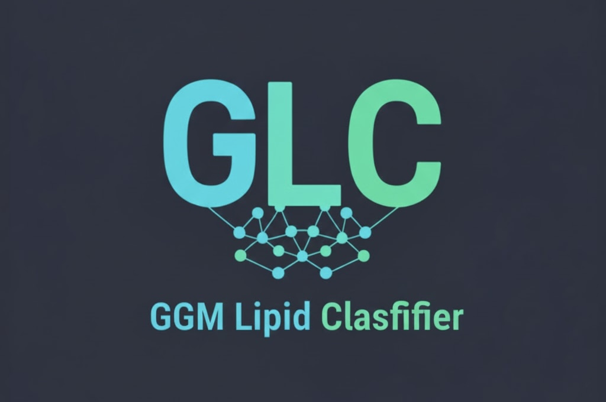

Tabs to pypi package and license ... 

GLC is a Python framework designed for ... [short snappy paragraph for what its about]

## Overview
### Features 
- Predict lipid class
- Quality scores 
- ...

### Sources and Materials 
The package source code is accessible via GitHub at [insert Github address]

Training materials including example data can be found at [insert link to tutorial]

# Installation 
## Dependencies 

[Copy dependencies from final .toml file]

## User Installation 

TODO: Don't forget stuff about having R installed on your system

### Installing with Pip
You can install GLC from PyPI using pip:
```bash
pip install glc
```

### Installing from source-code
You can install GLC from source code given you have installed ...

First, clone the respository from GitHub to your computer. You can use the following commands if you have a version of Git installed on your computer:

```bash
git clone [insert URL]
cd glc
```
When you are in the cloned project folder, type the foolowing code to install GLC and all dependencies:

```pip install .```

**Alternatively**, you can install dependencies using pip and GLC using Python: 

TODO: don't forget to generate a requirements file for this
```bash
pip install -r requirements.txt
python setup.py develop
```

# Issues and Colloboration
Thank you for supporting the GLC project. GLC is an open-source software and welcomes any form of contribution and support.

## Issues
Please submit any bugs or issues via the project's GitHub [link to issue page] issue page include any details about the (glc.__version__) together with any relevant input data/metadata. 

## Colloboration 

## Pull requests
You can actively colloborate on the GLC package by submitting any changes via a pull request. All pull requests will be reviewed by the GLC team and merged in due course. 

## Contributions
If you would like to become a contibuter on the GLC project, please contact [link to contact info] Thomas Rix. 

# Acknowledgment 
This package was developed as part of Thomas Rix's PhD project at Imperial College London, funded by [HUMAN GRANT STUFF]. It is free to use, published under BSD 3-Clause licence. 

Other acknwledgments. 

# Citing us
If you use GLC in a scientific publication, we would appreciate citations. 

## Release
[Add reference to the paper one day]

## Publication 

# References

# Version History

## v.1.0.0
**Initial Release**


